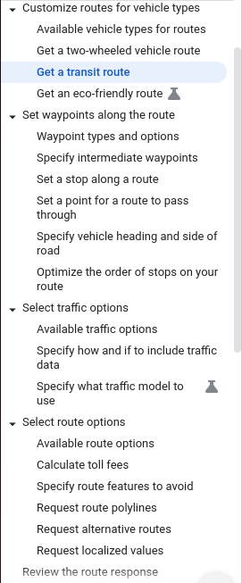

**Starting the project**
```
docker compose build
docker compose up -d
```
**Endpoints**
Blazor - localhost:8081
API - localhost:8082
- for development UI -> localhost:8082/swagger


**APVO**
- simulacija podataka i machine learning na simuliranim podacima
- iskoristiti model za nesto trece
- dodat podatke o gradovima sa google api/places api(npr. predikcija broja linija po broju stanovnika)


- ? dodat vrijeme polaska linija kako bi mogli vidjeti broj linija po gradu 
- ? predikcija arrival time za stajaliste koje ne postoji u nekoj ruti (ako dodamo novo stajaliste u rutu koliko bi produzili put)

**Linkovi**
https://developers.google.com/maps/documentation/routes/transit-route


request (train station 1, train station 2)
```
curl -X POST -H 'content-type: application/json' -d '{
  "origin": {
    "address": "Humberto Delgado Airport, Portugal"
  },
  "destination": {
    "address": "Basílica of Estrela, Praça da Estrela, 1200-667 Lisboa, Portugal"
  },
  "travelMode": "TRANSIT",
  "computeAlternativeRoutes": true,
  "transitPreferences": {
     routingPreference: "LESS_WALKING",
     allowedTravelModes: ["TRAIN"]
  },
}' \
-H 'Content-Type: application/json' \
-H 'X-Goog-Api-Key: YOUR_API_KEY' \
-H 'X-Goog-FieldMask: routes.legs.steps.transitDetails' \
'https://routes.googleapis.com/directions/v2:computeRoutes'
```
response
```
{
  "routes": [
    {
    "legs": [
        {
        "steps": [
          {},
          {},
          {},
          {
          "transitDetails": {
            "stopDetails": {
            "arrivalStop": {
              "name": "Saldanha",
              "location": {
                "latLng": {
                  "latitude": 38.73532,
                  "longitude": -9.14543
                }
              }
            },
            "arrivalTime": "2023-08-26T10:49:42Z",
            "departureStop": {
              "name": "Aeroporto",
              "location": {
                "latLng": {
                  "latitude": 38.769047799999996,
                  "longitude": -9.1284593
                }
              }
            },
            "departureTime": "2023-08-26T10:32:10Z"
              },
              "localizedValues": {
              "arrivalTime": {
                  "time": {
                    "text": "11:49"
                  },
                  "timeZone": "Europe/Lisbon"
              },
              "departureTime": {
                "time": {
                  "text": "11:32"
                },
                "timeZone": "Europe/Lisbon"
              }
            },
              "headsign": "São Sebastião",
              "transitLine": {
                "agencies": [
                  {
                    "name": "Metropolitano de Lisboa, E.P.E.",
                    "phoneNumber": "+351 21 350 0115",
                    "uri": "https://www.metrolisboa.pt/"
                  }
                ],
                "name": "Vermelha",
                "color": "#f23061",
                "nameShort": "Vm",
                "textColor": "#000000",
                "vehicle": {
                  "name": {
                    "text": "Metrô"
                  },
                "type": "SUBWAY",
                "iconUri": "//maps.gstatic.com/mapfiles/transit/iw2/6/subway2.png"
                }
              },
              "stopCount": 11
            }
          },
        {},
        {
          "transitDetails": {
            "stopDetails": {
              "arrivalStop": {
                "name": "Rato",
                "location": {
                  "latLng": {
                    "latitude": 38.7201022,
                    "longitude": -9.1540562
                  }
              }
            },
            "arrivalTime": "2023-08-26T11:01:37Z",
            "departureStop": {
              "name": "Saldanha",
                "location": {
                  "latLng": {
                    "latitude": 38.73527,
                    "longitude": -9.1455200000000012
                  }
                }
              },
              "departureTime": "2023-08-26T10:57:57Z"
            },
            "localizedValues": {
              "arrivalTime": {
                "time": {
                  "text": "12:01"
                },
                "timeZone": "Europe/Lisbon"
              },
              "departureTime": {
                "time": {
                  "text": "11:57"
                },
                "timeZone": "Europe/Lisbon"
              }
            },
            "headsign": "Rato",
            "transitLine": {
              "agencies": [
                {
                "name": "Metropolitano de Lisboa, E.P.E.",
                "phoneNumber": "+351 21 350 0115",
                "uri": "https://www.metrolisboa.pt/"
                }
              ],
              "name": "Amarela",
              "color": "#f2c200",
              "nameShort": "Am",
              "textColor": "#000000",
              "vehicle": {
                "name": {
                  "text": "Metrô"
                },
                "type": "SUBWAY",
                "iconUri": "//maps.gstatic.com/mapfiles/transit/iw2/6/subway2.png"
              }
            },
            "stopCount": 4
          }
        },
        {},
        {},
        {},
        {},
        {},
        {}
        ]
      }
    ]
  }
]
}
```

routes API potencijalni podaci



**Ideja podataka**
1. sa wikipedije dohvatit sva stajališta u nekoj državi(webscraping u csv)
2. izracunat udaljenost preko routes apija za linije(linije bi bile "fakeane" ukoliko postoji put od tocke a do tocke b linija moze postojati nije da nuzno postoji, ne vidim podatke za presjedanja)
